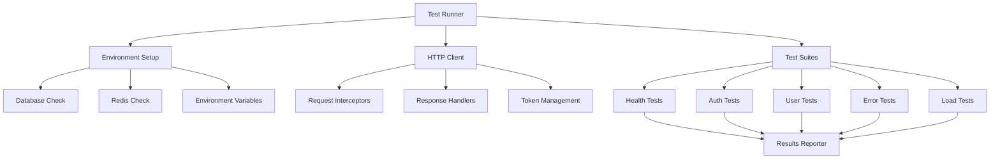

# Design Document: Backend API Testing

## Overview

This design outlines a comprehensive testing framework for the Syspro ERP backend API. The approach uses a combination of automated HTTP client testing, environment validation, and systematic endpoint verification to ensure all backend functionality works correctly. The testing framework will be built using Node.js with axios for HTTP requests and a custom test runner that provides detailed reporting and proper test isolation.

## Architecture

The testing system follows a modular architecture with clear separation of concerns:



### Core Components

1. **Test Runner**: Orchestrates test execution, manages test lifecycle, and coordinates reporting
2. **HTTP Client**: Handles all API communication with proper error handling and token management
3. **Environment Manager**: Validates and sets up the testing environment
4. **Test Suites**: Modular test collections for different API areas
5. **Results Reporter**: Provides detailed test results with pass/fail status and performance metrics

## Components and Interfaces

### Test Runner Interface

```typescript
interface TestRunner {
  setup(): Promise<void>;
  runSuite(suiteName: string): Promise<TestResults>;
  runAll(): Promise<TestResults[]>;
  cleanup(): Promise<void>;
}

interface TestResults {
  suiteName: string;
  totalTests: number;
  passed: number;
  failed: number;
  duration: number;
  results: TestResult[];
}

interface TestResult {
  name: string;
  status: 'passed' | 'failed' | 'skipped';
  duration: number;
  error?: string;
  response?: any;
}
```

### HTTP Client Interface

```typescript
interface APIClient {
  get(endpoint: string, options?: RequestOptions): Promise<APIResponse>;
  post(endpoint: string, data?: any, options?: RequestOptions): Promise<APIResponse>;
  patch(endpoint: string, data?: any, options?: RequestOptions): Promise<APIResponse>;
  setAuthToken(token: string): void;
  clearAuthToken(): void;
}

interface APIResponse {
  status: number;
  data: any;
  headers: Record<string, string>;
  duration: number;
}

interface RequestOptions {
  headers?: Record<string, string>;
  timeout?: number;
  validateStatus?: (status: number) => boolean;
}
```

### Test Suite Interface

```typescript
interface TestSuite {
  name: string;
  setup?(): Promise<void>;
  tests: TestCase[];
  cleanup?(): Promise<void>;
}

interface TestCase {
  name: string;
  run(client: APIClient): Promise<TestResult>;
  dependencies?: string[];
}
```

## Data Models

### Test Configuration

```typescript
interface TestConfig {
  baseURL: string;
  timeout: number;
  retries: number;
  parallel: boolean;
  environment: {
    requiredVars: string[];
    databaseURL: string;
    redisURL: string;
  };
  auth: {
    testUser: {
      email: string;
      password: string;
      firstName: string;
      lastName: string;
    };
  };
  performance: {
    maxResponseTime: number;
    concurrentUsers: number;
    loadTestDuration: number;
  };
}
```

### Authentication Context

```typescript
interface AuthContext {
  accessToken?: string;
  refreshToken?: string;
  expiresIn?: number;
  user?: {
    id: string;
    email: string;
    firstName: string;
    lastName: string;
    tenantId: string;
  };
}
```

## Implementation Strategy

### Phase 1: Core Infrastructure
- Set up test runner with configuration management
- Implement HTTP client with proper error handling
- Create environment validation and setup utilities
- Build results reporting system

### Phase 2: Basic Test Suites
- Implement health check tests
- Create authentication flow tests
- Add basic user endpoint tests
- Implement error scenario testing

### Phase 3: Advanced Testing
- Add performance and load testing capabilities
- Implement concurrent request testing
- Create comprehensive error handling tests
- Add test data management and cleanup

### Phase 4: Automation and CI/CD
- Create npm scripts for easy test execution
- Add test result formatting and reporting
- Implement test data seeding and cleanup
- Create documentation and usage guides

## Test Execution Flow

1. **Environment Validation**: Check all required environment variables and service connectivity
2. **Backend Health Check**: Verify the API is running and healthy
3. **Test Data Setup**: Create any necessary test data or reset database state
4. **Authentication Tests**: Test registration, login, token refresh, and logout flows
5. **Protected Endpoint Tests**: Test all authenticated endpoints with valid tokens
6. **Error Scenario Tests**: Test invalid inputs, expired tokens, and edge cases
7. **Performance Tests**: Run load tests and concurrent request scenarios
8. **Cleanup**: Remove test data and reset environment state
9. **Results Reporting**: Generate detailed test results with recommendations