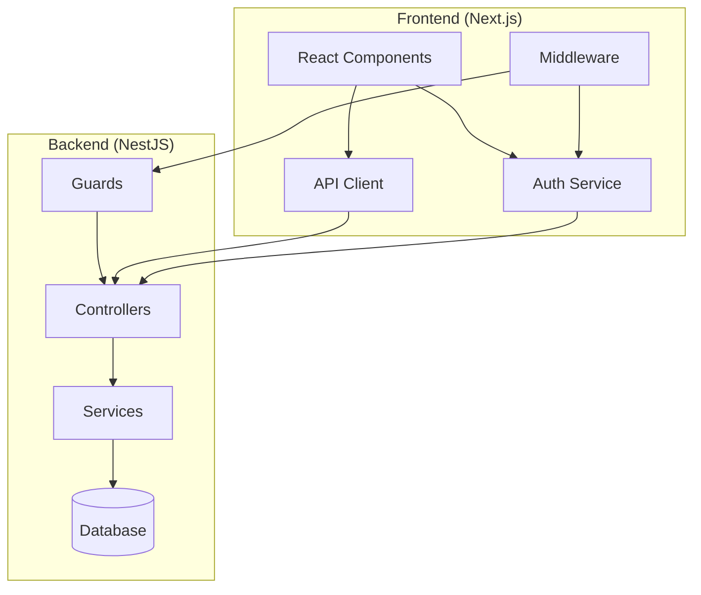
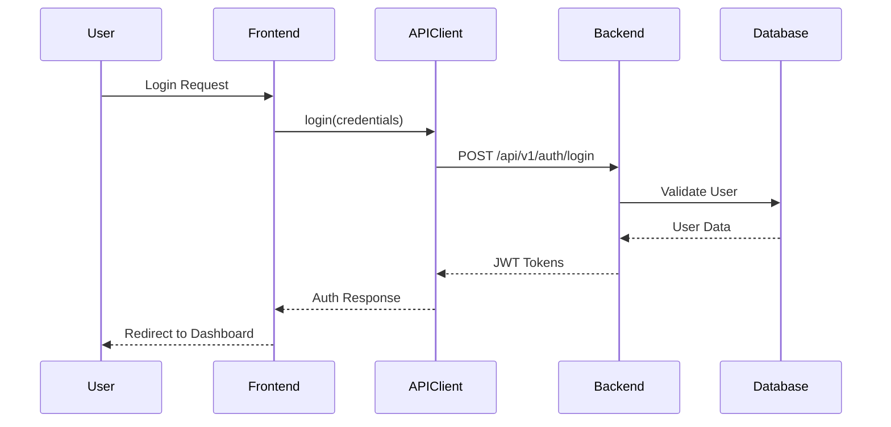

# Design Document: Frontend-Backend Integration

## Overview

This design establishes a proper integration architecture between the Next.js frontend and NestJS backend, replacing the current duplicate API routes with a clean client-server architecture. The solution implements a centralized API client, authentication management, and type-safe communication using shared TypeScript interfaces.

## Architecture

### High-Level Architecture



### Request Flow



## Components and Interfaces

### 1. API Client Service

**Location**: `apps/web/src/lib/api/client.ts`

The API client provides a centralized interface for all backend communication:

```typescript
interface APIClientConfig {
  baseURL: string;
  timeout: number;
  retries: number;
}

interface APIClient {
  // Authentication
  login(credentials: LoginRequest): Promise<AuthResponse>;
  register(data: RegisterRequest): Promise<AuthResponse>;
  refreshToken(token: string): Promise<AuthResponse>;
  logout(): Promise<void>;
  
  // User management
  getProfile(): Promise<UserProfile>;
  updateProfile(data: UpdateProfileRequest): Promise<UserProfile>;
  changePassword(data: ChangePasswordRequest): Promise<void>;
  
  // Health checks
  getHealth(): Promise<HealthStatus>;
}
```

**Key Features**:
- Automatic JWT token attachment
- Request/response interceptors
- Error handling and retry logic
- Tenant header management
- TypeScript type safety

### 2. Authentication Service

**Location**: `apps/web/src/lib/auth/auth-service.ts`

Manages authentication state and token lifecycle:

```typescript
interface AuthService {
  // State management
  isAuthenticated(): boolean;
  getCurrentUser(): AuthUser | null;
  getToken(): string | null;
  
  // Authentication actions
  login(credentials: LoginCredentials): Promise<AuthResult>;
  logout(): Promise<void>;
  refreshToken(): Promise<void>;
  
  // Event handling
  onAuthStateChange(callback: (user: AuthUser | null) => void): void;
}
```

**Token Management**:
- Secure storage using httpOnly cookies or localStorage
- Automatic refresh before expiration
- Token validation and cleanup

### 3. React Authentication Context

**Location**: `apps/web/src/contexts/auth-context.tsx`

Provides authentication state to React components:

```typescript
interface AuthContextValue {
  user: AuthUser | null;
  isLoading: boolean;
  isAuthenticated: boolean;
  login: (credentials: LoginCredentials) => Promise<void>;
  logout: () => Promise<void>;
  refreshToken: () => Promise<void>;
}
```

### 4. Next.js Middleware

**Location**: `apps/web/src/middleware.ts`

Handles route protection and authentication:

```typescript
interface MiddlewareConfig {
  protectedRoutes: string[];
  publicRoutes: string[];
  loginRedirect: string;
  dashboardRedirect: string;
}
```

**Responsibilities**:
- JWT token validation
- Route protection
- Automatic redirects
- Tenant context extraction

## Data Models

### Request/Response Types

Using shared types from `@syspro/shared`:

```typescript
// Authentication
interface LoginRequest {
  email: string;
  password: string;
  tenantId?: string;
}

interface AuthResponse {
  success: boolean;
  data: {
    accessToken: string;
    refreshToken: string;
    expiresIn: number;
    user: AuthUser;
  };
}

// API Error Response
interface APIError {
  success: false;
  message: string;
  errors?: ValidationError[];
  code?: string;
}
```

### Component Props

```typescript
// Login Form
interface LoginFormProps {
  onSubmit: (credentials: LoginCredentials) => Promise<void>;
  isLoading: boolean;
  error?: string;
}

// Dashboard Layout
interface DashboardLayoutProps {
  user: AuthUser;
  children: React.ReactNode;
  onLogout: () => Promise<void>;
}
```

## Correctness Properties

*A property is a characteristic or behavior that should hold true across all valid executions of a system-essentially, a formal statement about what the system should do. Properties serve as the bridge between human-readable specifications and machine-verifiable correctness guarantees.*

### Property Reflection

After analyzing all acceptance criteria, I identified several areas where properties can be consolidated:

**Redundancy Analysis:**
- Properties 1.1 and 1.2 (authentication and health check routing) can be combined into a single "backend routing" property
- Properties 2.2 and 2.5 (authentication headers and tenant headers) can be combined into a single "request headers" property  
- Properties 7.1, 7.3, and 7.5 (error handling, loading states, logging) represent different aspects of user feedback and should remain separate
- Properties 3.2 and 3.6 (token storage and cleanup) represent different lifecycle events and should remain separate

**Final Property Set:**
After consolidation, the following properties provide comprehensive coverage without redundancy:

### Correctness Properties

Property 1: Backend API routing
*For any* API request (authentication, health checks, user operations), the request should be sent to the backend API URL rather than local Next.js route handlers
**Validates: Requirements 1.1, 1.2**

Property 2: Automatic request headers
*For any* authenticated API request, the request should automatically include both Authorization and tenant headers when available
**Validates: Requirements 2.2, 2.5**

Property 3: Consistent error handling
*For any* API error response, the error should be processed consistently and return a standardized error format
**Validates: Requirements 2.3**

Property 4: Request interceptor functionality
*For any* API request, registered interceptors should be called and able to modify the request before sending
**Validates: Requirements 2.4**

Property 5: Authentication state management
*For any* authentication state change (login, logout, token refresh), the auth service should update the global authentication state and notify all subscribers
**Validates: Requirements 3.1, 3.5, 3.6**

Property 6: Token lifecycle management
*For any* JWT token approaching expiration, the auth service should automatically attempt to refresh the token before it expires
**Validates: Requirements 3.3**

Property 7: Authentication redirect behavior
*For any* expired or invalid token, the system should redirect the user to the login page
**Validates: Requirements 3.4**

Property 8: Form validation before submission
*For any* form submission, client-side validation should complete successfully before the request is sent to the backend
**Validates: Requirements 4.6**

Property 9: UI state during async operations
*For any* API request initiated from a UI component, a loading indicator should be displayed until the request completes
**Validates: Requirements 4.5, 7.3**

Property 10: Route protection
*For any* protected route access attempt, unauthenticated users should be redirected to the login page
**Validates: Requirements 5.4, 5.5**

Property 11: Middleware token processing
*For any* incoming request with a JWT token, the middleware should extract, validate, and add user context to the request
**Validates: Requirements 5.1, 5.2**

Property 12: User-friendly error display
*For any* API error, the frontend should display a user-friendly error message while logging detailed error information for debugging
**Validates: Requirements 7.1, 7.5**

Property 13: Network error recovery
*For any* network error, the system should provide retry options and handle the error gracefully without crashing
**Validates: Requirements 7.2**

Property 14: Form validation error highlighting
*For any* form validation error, the specific form fields with errors should be visually highlighted
**Validates: Requirements 7.4**

Property 15: API response type validation
*For any* API response, the response data should be validated against the expected TypeScript interface
**Validates: Requirements 8.3**

Property 16: Type mismatch handling
*For any* API response that doesn't match the expected type, the system should handle the mismatch gracefully without crashing
**Validates: Requirements 8.4**

## Error Handling

### API Error Handling Strategy

```typescript
interface ErrorHandlingStrategy {
  // Network errors
  handleNetworkError(error: NetworkError): Promise<void>;
  
  // HTTP errors
  handleHTTPError(error: HTTPError): Promise<void>;
  
  // Validation errors
  handleValidationError(errors: ValidationError[]): void;
  
  // Authentication errors
  handleAuthError(error: AuthError): Promise<void>;
}
```

**Error Categories:**
1. **Network Errors**: Connection failures, timeouts
2. **HTTP Errors**: 4xx/5xx status codes from backend
3. **Validation Errors**: Client-side form validation failures
4. **Authentication Errors**: Token expiration, invalid credentials
5. **Type Errors**: Response type mismatches

**Error Recovery Mechanisms:**
- Automatic retry with exponential backoff
- Fallback to cached data when available
- Graceful degradation of functionality
- User-friendly error messages with actionable guidance

### Authentication Error Handling

```typescript
interface AuthErrorHandler {
  handleTokenExpired(): Promise<void>;
  handleInvalidCredentials(): void;
  handleNetworkAuthError(): Promise<void>;
  handleRefreshTokenFailure(): Promise<void>;
}
```

## Testing Strategy

### Dual Testing Approach

The testing strategy combines unit tests for specific scenarios with property-based tests for comprehensive coverage:

**Unit Tests:**
- Specific login/logout scenarios
- Error boundary behavior
- Component rendering with different props
- Middleware route protection logic
- API client method signatures

**Property-Based Tests:**
- API request routing verification (Property 1)
- Header injection across all requests (Property 2)
- Error handling consistency (Property 3)
- Authentication state transitions (Property 5)
- Token refresh timing (Property 6)
- Form validation behavior (Property 8)
- UI loading states (Property 9)
- Route protection (Property 10)

**Testing Configuration:**
- Use Jest with React Testing Library for component tests
- Use MSW (Mock Service Worker) for API mocking
- Property tests run minimum 100 iterations
- Each property test tagged with: **Feature: frontend-backend-integration, Property {number}: {property_text}**

**Integration Testing:**
- End-to-end authentication flows
- Cross-component state management
- API client integration with real backend
- Middleware integration with Next.js routing

### Test Environment Setup

```typescript
// Test configuration
interface TestConfig {
  apiBaseURL: string;
  mockBackend: boolean;
  authTokens: {
    valid: string;
    expired: string;
    invalid: string;
  };
}
```

The testing strategy ensures both specific edge cases are covered through unit tests and general correctness is verified through property-based testing across all possible inputs and states.