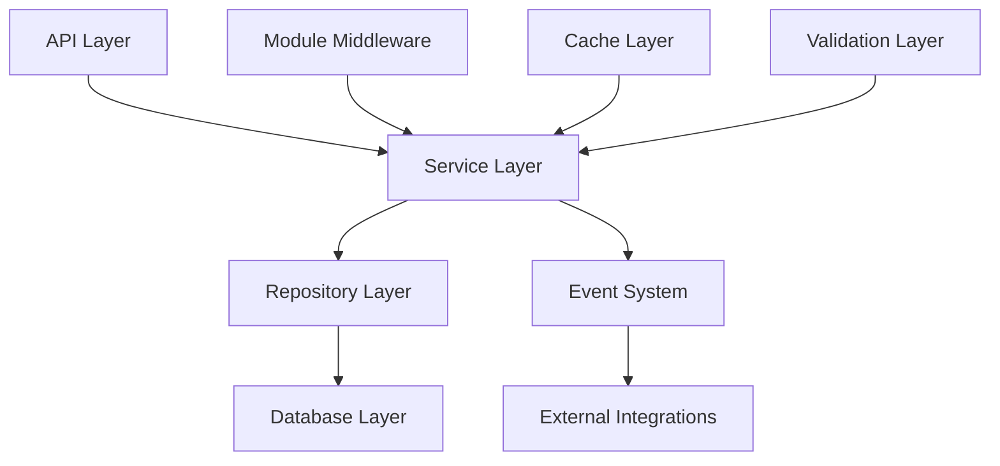

# Design Document

## Overview

The Module Registry System is a comprehensive solution for managing ERP modules in a multi-tenant SaaS environment. It provides centralized module definition, tenant-specific enablement, access control enforcement, version management, and billing integration. The system is designed to be scalable, secure, and developer-friendly while maintaining high performance for API request filtering.

## Architecture

The Module Registry System follows a layered architecture with clear separation of concerns:



### Core Components

1. **Module Registry Service**: Central management of module definitions and metadata
2. **Tenant Module Service**: Management of tenant-specific module enablement and configuration
3. **Module Middleware**: Request-level access control enforcement
4. **Version Manager**: Module version compatibility and upgrade management
5. **Configuration Manager**: Module-specific settings and feature flags
6. **Analytics Collector**: Usage tracking and metrics collection

## Components and Interfaces

### Database Schema

#### Module Registry Table
```sql
CREATE TABLE module_registry (
    id UUID PRIMARY KEY DEFAULT gen_random_uuid(),
    name VARCHAR(100) NOT NULL UNIQUE,
    display_name VARCHAR(200) NOT NULL,
    description TEXT,
    category VARCHAR(50) NOT NULL, -- 'core', 'business', 'integration', 'analytics'
    version VARCHAR(20) NOT NULL,
    is_active BOOLEAN DEFAULT true,
    is_core BOOLEAN DEFAULT false, -- Cannot be disabled
    pricing_model VARCHAR(50), -- 'free', 'flat_rate', 'per_user', 'usage_based'
    base_price DECIMAL(10,2) DEFAULT 0,
    per_user_price DECIMAL(10,2) DEFAULT 0,
    dependencies JSONB DEFAULT '[]', -- Array of module names
    optional_dependencies JSONB DEFAULT '[]',
    configuration_schema JSONB DEFAULT '{}',
    feature_flags JSONB DEFAULT '{}',
    api_endpoints JSONB DEFAULT '[]', -- Protected endpoints
    created_at TIMESTAMP WITH TIME ZONE DEFAULT NOW(),
    updated_at TIMESTAMP WITH TIME ZONE DEFAULT NOW()
);

CREATE INDEX idx_module_registry_category ON module_registry(category);
CREATE INDEX idx_module_registry_active ON module_registry(is_active);
```

#### Tenant Modules Table
```sql
CREATE TABLE tenant_modules (
    id UUID PRIMARY KEY DEFAULT gen_random_uuid(),
    tenant_id UUID NOT NULL REFERENCES tenants(id) ON DELETE CASCADE,
    module_name VARCHAR(100) NOT NULL REFERENCES module_registry(name),
    is_enabled BOOLEAN DEFAULT true,
    version VARCHAR(20) NOT NULL,
    configuration JSONB DEFAULT '{}',
    feature_flags JSONB DEFAULT '{}',
    enabled_at TIMESTAMP WITH TIME ZONE DEFAULT NOW(),
    enabled_by UUID REFERENCES users(id),
    disabled_at TIMESTAMP WITH TIME ZONE,
    disabled_by UUID REFERENCES users(id),
    created_at TIMESTAMP WITH TIME ZONE DEFAULT NOW(),
    updated_at TIMESTAMP WITH TIME ZONE DEFAULT NOW(),
    
    UNIQUE(tenant_id, module_name)
);

CREATE INDEX idx_tenant_modules_tenant ON tenant_modules(tenant_id);
CREATE INDEX idx_tenant_modules_enabled ON tenant_modules(tenant_id, is_enabled);
```

#### Module Usage Analytics Table
```sql
CREATE TABLE module_usage_analytics (
    id UUID PRIMARY KEY DEFAULT gen_random_uuid(),
    tenant_id UUID NOT NULL REFERENCES tenants(id) ON DELETE CASCADE,
    module_name VARCHAR(100) NOT NULL,
    endpoint VARCHAR(200),
    request_count INTEGER DEFAULT 1,
    response_time_ms INTEGER,
    error_count INTEGER DEFAULT 0,
    date DATE NOT NULL,
    hour INTEGER NOT NULL CHECK (hour >= 0 AND hour <= 23),
    created_at TIMESTAMP WITH TIME ZONE DEFAULT NOW(),
    
    UNIQUE(tenant_id, module_name, endpoint, date, hour)
);

CREATE INDEX idx_module_usage_tenant_date ON module_usage_analytics(tenant_id, date);
CREATE INDEX idx_module_usage_module_date ON module_usage_analytics(module_name, date);
```

### TypeScript Entities

#### Module Registry Entity
```typescript
@Entity('module_registry')
export class ModuleRegistry extends BaseEntity {
  @Column({ length: 100, unique: true })
  name: string;

  @Column({ length: 200 })
  displayName: string;

  @Column({ type: 'text', nullable: true })
  description?: string;

  @Column({ 
    type: 'enum', 
    enum: ['core', 'business', 'integration', 'analytics'] 
  })
  category: string;

  @Column({ length: 20 })
  version: string;

  @Column({ default: true })
  isActive: boolean;

  @Column({ default: false })
  isCore: boolean;

  @Column({ 
    type: 'enum', 
    enum: ['free', 'flat_rate', 'per_user', 'usage_based'],
    nullable: true 
  })
  pricingModel?: string;

  @Column({ type: 'decimal', precision: 10, scale: 2, default: 0 })
  basePrice: number;

  @Column({ type: 'decimal', precision: 10, scale: 2, default: 0 })
  perUserPrice: number;

  @Column({ type: 'jsonb', default: [] })
  dependencies: string[];

  @Column({ type: 'jsonb', default: [] })
  optionalDependencies: string[];

  @Column({ type: 'jsonb', default: {} })
  configurationSchema: Record<string, any>;

  @Column({ type: 'jsonb', default: {} })
  featureFlags: Record<string, any>;

  @Column({ type: 'jsonb', default: [] })
  apiEndpoints: string[];

  @OneToMany(() => TenantModule, (tenantModule) => tenantModule.moduleRegistry)
  tenantModules: TenantModule[];
}
```

#### Tenant Module Entity
```typescript
@Entity('tenant_modules')
@Index(['tenantId', 'isEnabled'])
export class TenantModule extends BaseEntity {
  @Column('uuid')
  tenantId: string;

  @Column({ length: 100 })
  moduleName: string;

  @Column({ default: true })
  isEnabled: boolean;

  @Column({ length: 20 })
  version: string;

  @Column({ type: 'jsonb', default: {} })
  configuration: Record<string, any>;

  @Column({ type: 'jsonb', default: {} })
  featureFlags: Record<string, any>;

  @Column({ type: 'timestamp with time zone', default: () => 'NOW()' })
  enabledAt: Date;

  @Column('uuid', { nullable: true })
  enabledBy?: string;

  @Column({ type: 'timestamp with time zone', nullable: true })
  disabledAt?: Date;

  @Column('uuid', { nullable: true })
  disabledBy?: string;

  // Relationships
  @ManyToOne(() => Tenant, { onDelete: 'CASCADE' })
  tenant: Tenant;

  @ManyToOne(() => ModuleRegistry, (module) => module.tenantModules)
  moduleRegistry: ModuleRegistry;

  @ManyToOne(() => User, { nullable: true })
  enabledByUser?: User;

  @ManyToOne(() => User, { nullable: true })
  disabledByUser?: User;
}
```

### Service Layer

#### Module Registry Service
```typescript
@Injectable()
export class ModuleRegistryService {
  constructor(
    @InjectRepository(ModuleRegistry)
    private moduleRepository: Repository<ModuleRegistry>,
    private cacheService: CacheService,
    private eventEmitter: EventEmitter2,
  ) {}

  async registerModule(moduleData: CreateModuleDto): Promise<ModuleRegistry> {
    // Validate dependencies exist
    await this.validateDependencies(moduleData.dependencies);
    
    const module = this.moduleRepository.create(moduleData);
    const savedModule = await this.moduleRepository.save(module);
    
    // Clear cache
    await this.cacheService.del('modules:all');
    
    // Emit event
    this.eventEmitter.emit('module.registered', savedModule);
    
    return savedModule;
  }

  async getAllModules(): Promise<ModuleRegistry[]> {
    const cacheKey = 'modules:all';
    let modules = await this.cacheService.get<ModuleRegistry[]>(cacheKey);
    
    if (!modules) {
      modules = await this.moduleRepository.find({
        where: { isActive: true },
        order: { category: 'ASC', name: 'ASC' }
      });
      await this.cacheService.set(cacheKey, modules, 300); // 5 minutes
    }
    
    return modules;
  }

  async getModulesByCategory(category: string): Promise<ModuleRegistry[]> {
    return this.moduleRepository.find({
      where: { category, isActive: true },
      order: { name: 'ASC' }
    });
  }

  private async validateDependencies(dependencies: string[]): Promise<void> {
    if (!dependencies?.length) return;
    
    const existingModules = await this.moduleRepository.find({
      where: { name: In(dependencies), isActive: true }
    });
    
    const missingDeps = dependencies.filter(
      dep => !existingModules.find(m => m.name === dep)
    );
    
    if (missingDeps.length > 0) {
      throw new BadRequestException(
        `Missing dependencies: ${missingDeps.join(', ')}`
      );
    }
  }
}
```

#### Tenant Module Service
```typescript
@Injectable()
export class TenantModuleService {
  constructor(
    @InjectRepository(TenantModule)
    private tenantModuleRepository: Repository<TenantModule>,
    @InjectRepository(ModuleRegistry)
    private moduleRepository: Repository<ModuleRegistry>,
    private cacheService: CacheService,
    private eventEmitter: EventEmitter2,
  ) {}

  async enableModule(
    tenantId: string, 
    moduleName: string, 
    userId: string,
    configuration?: Record<string, any>
  ): Promise<TenantModule> {
    // Get module definition
    const module = await this.moduleRepository.findOne({
      where: { name: moduleName, isActive: true }
    });
    
    if (!module) {
      throw new NotFoundException(`Module ${moduleName} not found`);
    }

    // Check and enable dependencies
    await this.enableDependencies(tenantId, module.dependencies, userId);

    // Check if already enabled
    let tenantModule = await this.tenantModuleRepository.findOne({
      where: { tenantId, moduleName }
    });

    if (tenantModule) {
      if (tenantModule.isEnabled) {
        throw new ConflictException(`Module ${moduleName} is already enabled`);
      }
      // Re-enable
      tenantModule.isEnabled = true;
      tenantModule.enabledAt = new Date();
      tenantModule.enabledBy = userId;
      tenantModule.disabledAt = null;
      tenantModule.disabledBy = null;
    } else {
      // Create new
      tenantModule = this.tenantModuleRepository.create({
        tenantId,
        moduleName,
        version: module.version,
        configuration: configuration || {},
        featureFlags: module.featureFlags,
        enabledBy: userId,
      });
    }

    const savedModule = await this.tenantModuleRepository.save(tenantModule);
    
    // Clear cache
    await this.clearTenantModuleCache(tenantId);
    
    // Emit event for billing integration
    this.eventEmitter.emit('module.enabled', {
      tenantId,
      moduleName,
      module,
      userId
    });
    
    return savedModule;
  }

  async disableModule(
    tenantId: string, 
    moduleName: string, 
    userId: string
  ): Promise<void> {
    const module = await this.moduleRepository.findOne({
      where: { name: moduleName }
    });
    
    if (module?.isCore) {
      throw new BadRequestException('Cannot disable core modules');
    }

    // Check for dependent modules
    await this.checkDependentModules(tenantId, moduleName);

    const tenantModule = await this.tenantModuleRepository.findOne({
      where: { tenantId, moduleName, isEnabled: true }
    });

    if (!tenantModule) {
      throw new NotFoundException(`Module ${moduleName} is not enabled`);
    }

    tenantModule.isEnabled = false;
    tenantModule.disabledAt = new Date();
    tenantModule.disabledBy = userId;

    await this.tenantModuleRepository.save(tenantModule);
    
    // Clear cache
    await this.clearTenantModuleCache(tenantId);
    
    // Emit event
    this.eventEmitter.emit('module.disabled', {
      tenantId,
      moduleName,
      userId
    });
  }

  async getTenantModules(tenantId: string): Promise<TenantModule[]> {
    const cacheKey = `tenant:${tenantId}:modules`;
    let modules = await this.cacheService.get<TenantModule[]>(cacheKey);
    
    if (!modules) {
      modules = await this.tenantModuleRepository.find({
        where: { tenantId, isEnabled: true },
        relations: ['moduleRegistry']
      });
      await this.cacheService.set(cacheKey, modules, 300);
    }
    
    return modules;
  }

  async hasModuleAccess(tenantId: string, moduleName: string): Promise<boolean> {
    const cacheKey = `tenant:${tenantId}:module:${moduleName}`;
    let hasAccess = await this.cacheService.get<boolean>(cacheKey);
    
    if (hasAccess === null || hasAccess === undefined) {
      const tenantModule = await this.tenantModuleRepository.findOne({
        where: { tenantId, moduleName, isEnabled: true }
      });
      hasAccess = !!tenantModule;
      await this.cacheService.set(cacheKey, hasAccess, 300);
    }
    
    return hasAccess;
  }

  private async enableDependencies(
    tenantId: string, 
    dependencies: string[], 
    userId: string
  ): Promise<void> {
    for (const dep of dependencies) {
      const hasAccess = await this.hasModuleAccess(tenantId, dep);
      if (!hasAccess) {
        await this.enableModule(tenantId, dep, userId);
      }
    }
  }

  private async checkDependentModules(
    tenantId: string, 
    moduleName: string
  ): Promise<void> {
    const dependentModules = await this.moduleRepository
      .createQueryBuilder('module')
      .where('module.dependencies @> :moduleName', { 
        moduleName: JSON.stringify([moduleName]) 
      })
      .getMany();

    const enabledDependents = [];
    for (const module of dependentModules) {
      const hasAccess = await this.hasModuleAccess(tenantId, module.name);
      if (hasAccess) {
        enabledDependents.push(module.name);
      }
    }

    if (enabledDependents.length > 0) {
      throw new BadRequestException(
        `Cannot disable ${moduleName}. Required by: ${enabledDependents.join(', ')}`
      );
    }
  }

  private async clearTenantModuleCache(tenantId: string): Promise<void> {
    const pattern = `tenant:${tenantId}:*`;
    await this.cacheService.delPattern(pattern);
  }
}
```

### Module Access Middleware

```typescript
@Injectable()
export class ModuleAccessMiddleware implements NestMiddleware {
  constructor(
    private tenantModuleService: TenantModuleService,
    private moduleRepository: Repository<ModuleRegistry>,
    private logger: Logger,
  ) {}

  async use(req: Request, res: Response, next: NextFunction) {
    const tenantId = req.headers['x-tenant-id'] as string;
    const path = req.path;

    // Skip for health checks and auth endpoints
    if (this.shouldSkipCheck(path)) {
      return next();
    }

    // Get module name from path
    const moduleName = this.extractModuleFromPath(path);
    if (!moduleName) {
      return next();
    }

    // Check if tenant has access to module
    const hasAccess = await this.tenantModuleService.hasModuleAccess(
      tenantId, 
      moduleName
    );

    if (!hasAccess) {
      this.logger.warn(`Module access denied: ${tenantId} -> ${moduleName}`, {
        tenantId,
        moduleName,
        path,
        ip: req.ip,
      });

      return res.status(403).json({
        error: 'Module Access Denied',
        message: `Module '${moduleName}' is not enabled for your organization`,
        moduleName,
        code: 'MODULE_NOT_ENABLED'
      });
    }

    // Add module context to request
    req['moduleContext'] = {
      moduleName,
      hasAccess: true
    };

    next();
  }

  private shouldSkipCheck(path: string): boolean {
    const skipPaths = [
      '/health',
      '/api/v1/auth',
      '/api/v1/health',
      '/api/v1/modules', // Module management endpoints
    ];
    
    return skipPaths.some(skipPath => path.startsWith(skipPath));
  }

  private extractModuleFromPath(path: string): string | null {
    // Extract module from API path: /api/v1/{module}/...
    const match = path.match(/^\/api\/v1\/([^\/]+)/);
    return match ? match[1] : null;
  }
}
```

## Data Models

### DTOs

```typescript
export class CreateModuleDto {
  @IsString()
  @Length(2, 100)
  name: string;

  @IsString()
  @Length(2, 200)
  displayName: string;

  @IsOptional()
  @IsString()
  description?: string;

  @IsEnum(['core', 'business', 'integration', 'analytics'])
  category: string;

  @IsString()
  @Matches(/^\d+\.\d+\.\d+$/)
  version: string;

  @IsOptional()
  @IsEnum(['free', 'flat_rate', 'per_user', 'usage_based'])
  pricingModel?: string;

  @IsOptional()
  @IsNumber()
  @Min(0)
  basePrice?: number;

  @IsOptional()
  @IsNumber()
  @Min(0)
  perUserPrice?: number;

  @IsOptional()
  @IsArray()
  @IsString({ each: true })
  dependencies?: string[];

  @IsOptional()
  @IsArray()
  @IsString({ each: true })
  optionalDependencies?: string[];

  @IsOptional()
  @IsObject()
  configurationSchema?: Record<string, any>;

  @IsOptional()
  @IsObject()
  featureFlags?: Record<string, any>;

  @IsOptional()
  @IsArray()
  @IsString({ each: true })
  apiEndpoints?: string[];
}

export class EnableModuleDto {
  @IsString()
  moduleName: string;

  @IsOptional()
  @IsObject()
  configuration?: Record<string, any>;
}

export class UpdateModuleConfigDto {
  @IsObject()
  configuration: Record<string, any>;

  @IsOptional()
  @IsObject()
  featureFlags?: Record<string, any>;
}
```

## Correctness Properties

*A property is a characteristic or behavior that should hold true across all valid executions of a system-essentially, a formal statement about what the system should do. Properties serve as the bridge between human-readable specifications and machine-verifiable correctness guarantees.*

### Property Reflection

After analyzing all acceptance criteria, I identified several areas where properties can be consolidated:

- **Module Storage Properties**: Properties 1-5 can be combined into comprehensive module data integrity properties
- **Module Lifecycle Properties**: Properties 6-10 can be consolidated into module state management properties  
- **Access Control Properties**: Properties 11-15 can be unified into comprehensive access control validation
- **Version Management Properties**: Properties 16-18 focus on version handling and can be streamlined
- **Configuration Properties**: Properties 19-23 cover configuration management comprehensively
- **Dependency Properties**: Properties 24-27 handle dependency resolution and validation
- **Analytics Properties**: Properties 28-32 cover usage tracking and metrics
- **Billing Integration Properties**: Properties 33-37 handle billing system integration
- **Permission Properties**: Properties 38-42 manage permission integration
- **API Properties**: Properties 43-47 cover API functionality and events

### Core Correctness Properties

**Property 1: Module Registry Data Integrity**
*For any* module registration data, storing and retrieving the module should preserve all metadata fields including name, description, version, dependencies, and pricing information
**Validates: Requirements 1.1, 1.5**

**Property 2: Module Uniqueness Enforcement**
*For any* module registration attempt, the system should reject modules with duplicate names and enforce unique identifiers across the registry
**Validates: Requirements 1.4**

**Property 3: Module Compatibility Validation**
*For any* new module registration, the system should validate compatibility with existing modules and reject incompatible combinations
**Validates: Requirements 1.2**

**Property 4: Module Categorization Consistency**
*For any* module, the system should enforce valid category assignment and maintain consistent categorization across all operations
**Validates: Requirements 1.3**

**Property 5: Tenant Module Lifecycle Management**
*For any* tenant and module combination, enabling a module should create proper associations with configuration, and disabling should preserve data while deactivating access
**Validates: Requirements 2.1, 2.2, 2.5**

**Property 6: Core Module Protection**
*For any* attempt to disable a core module or a module with active dependencies, the system should prevent the operation and maintain system integrity
**Validates: Requirements 2.3**

**Property 7: Default Configuration Application**
*For any* module enablement, the system should apply appropriate default configuration settings based on the module's schema
**Validates: Requirements 2.4**

**Property 8: Module Access Control Enforcement**
*For any* API request, the middleware should correctly verify tenant module access and return appropriate responses for enabled/disabled modules
**Validates: Requirements 3.1, 3.2, 3.3**

**Property 9: Access Denial Logging and Security**
*For any* denied module access attempt, the system should log the attempt with proper context and return standardized error responses
**Validates: Requirements 3.4, 3.5**

**Property 10: Module Version Management**
*For any* module with multiple versions, the system should correctly assign latest compatible versions and support version transitions within compatibility constraints
**Validates: Requirements 4.1, 4.2, 4.3, 4.5**

**Property 11: Module Configuration Validation**
*For any* module configuration update, the system should validate against the module's schema and maintain configuration integrity
**Validates: Requirements 5.1, 5.3, 5.5**

**Property 12: Feature Flag Management**
*For any* tenant-module combination, feature flags should be correctly toggled and tracked per tenant per module
**Validates: Requirements 5.2, 7.4**

**Property 13: Configuration Template Application**
*For any* business scenario template, the system should correctly apply default configurations and maintain template consistency
**Validates: Requirements 5.4**

**Property 14: Dependency Resolution**
*For any* module with dependencies, enabling should automatically resolve and enable required dependencies, while disabling should prevent conflicts
**Validates: Requirements 6.1, 6.2, 6.4**

**Property 15: Optional Dependency Handling**
*For any* module with optional dependencies, the system should enhance functionality when available without breaking core features when absent
**Validates: Requirements 6.5**

**Property 16: Usage Analytics Collection**
*For any* module usage, the system should accurately track activation events, API usage, and performance metrics while maintaining tenant privacy
**Validates: Requirements 7.1, 7.2, 7.3, 7.5**

**Property 17: Billing Integration Consistency**
*For any* paid module operation, the system should create appropriate billing records, handle proration correctly, and support all pricing models
**Validates: Requirements 8.1, 8.2, 8.3, 8.4, 8.5**

**Property 18: Permission Integration**
*For any* user permission check, the system should correctly filter permissions based on enabled modules and maintain permission state during module changes
**Validates: Requirements 9.1, 9.2, 9.4, 9.5**

**Property 19: Role Template Functionality**
*For any* module-specific role template, the system should correctly apply permissions and maintain template consistency
**Validates: Requirements 9.3**

**Property 20: API Functionality and Events**
*For any* module management API operation, the system should provide correct CRUD functionality, proper authorization, and emit appropriate events
**Validates: Requirements 10.1, 10.2, 10.3, 10.4, 10.5**

## Error Handling

The Module Registry System implements comprehensive error handling across all layers:

### Validation Errors
- **Module Registration**: Invalid module data, duplicate names, missing dependencies
- **Configuration Updates**: Schema validation failures, invalid feature flag values
- **Version Management**: Incompatible version transitions, missing version dependencies

### Business Logic Errors
- **Dependency Conflicts**: Circular dependencies, missing required modules
- **Access Control**: Unauthorized module operations, insufficient permissions
- **State Conflicts**: Attempting to disable modules with active dependencies

### Integration Errors
- **Billing System**: Failed billing record creation, proration calculation errors
- **Cache System**: Cache invalidation failures, cache consistency issues
- **Event System**: Event emission failures, webhook delivery issues

### Error Response Format
```typescript
interface ModuleError {
  error: string;
  message: string;
  code: string;
  details?: {
    moduleName?: string;
    dependencies?: string[];
    conflicts?: string[];
  };
  timestamp: string;
}
```

## Testing Strategy

The Module Registry System employs a dual testing approach combining unit tests and property-based tests for comprehensive coverage.

### Unit Testing
Unit tests focus on specific examples, edge cases, and integration points:

- **Service Layer**: Test specific business logic scenarios and error conditions
- **Repository Layer**: Test database operations and query correctness
- **Middleware**: Test request filtering and context injection
- **DTOs**: Test validation rules and data transformation
- **Integration Points**: Test external system interactions

### Property-Based Testing
Property tests validate universal properties across all inputs using **fast-check** library:

- **Minimum 100 iterations** per property test due to randomization
- **Comprehensive input coverage** through intelligent generators
- **State-based testing** for module lifecycle operations
- **Invariant validation** for data consistency properties

### Property Test Configuration
Each property test must:
- Reference its corresponding design document property
- Use tag format: **Feature: module-registry-system, Property {number}: {property_text}**
- Generate realistic test data using smart generators
- Validate both success and failure scenarios

### Test Data Generators
```typescript
// Smart generators for property testing
const moduleGenerator = fc.record({
  name: fc.string({ minLength: 2, maxLength: 100 }),
  displayName: fc.string({ minLength: 2, maxLength: 200 }),
  category: fc.constantFrom('core', 'business', 'integration', 'analytics'),
  version: fc.string().filter(s => /^\d+\.\d+\.\d+$/.test(s)),
  dependencies: fc.array(fc.string(), { maxLength: 5 }),
  pricingModel: fc.constantFrom('free', 'flat_rate', 'per_user', 'usage_based')
});

const tenantModuleGenerator = fc.record({
  tenantId: fc.uuid(),
  moduleName: fc.string({ minLength: 2, maxLength: 100 }),
  configuration: fc.dictionary(fc.string(), fc.anything()),
  featureFlags: fc.dictionary(fc.string(), fc.boolean())
});
```

### Integration Testing
- **End-to-end module lifecycle**: Registration → enablement → usage → disabling
- **Cross-service integration**: Module registry ↔ billing system ↔ permission system
- **Performance testing**: Cache effectiveness, middleware overhead, bulk operations
- **Security testing**: Access control enforcement, audit trail completeness

This comprehensive testing strategy ensures the Module Registry System maintains correctness, performance, and security across all operational scenarios.

<function_calls>
<invoke name="prework">
<parameter name="featureName">module-registry-system