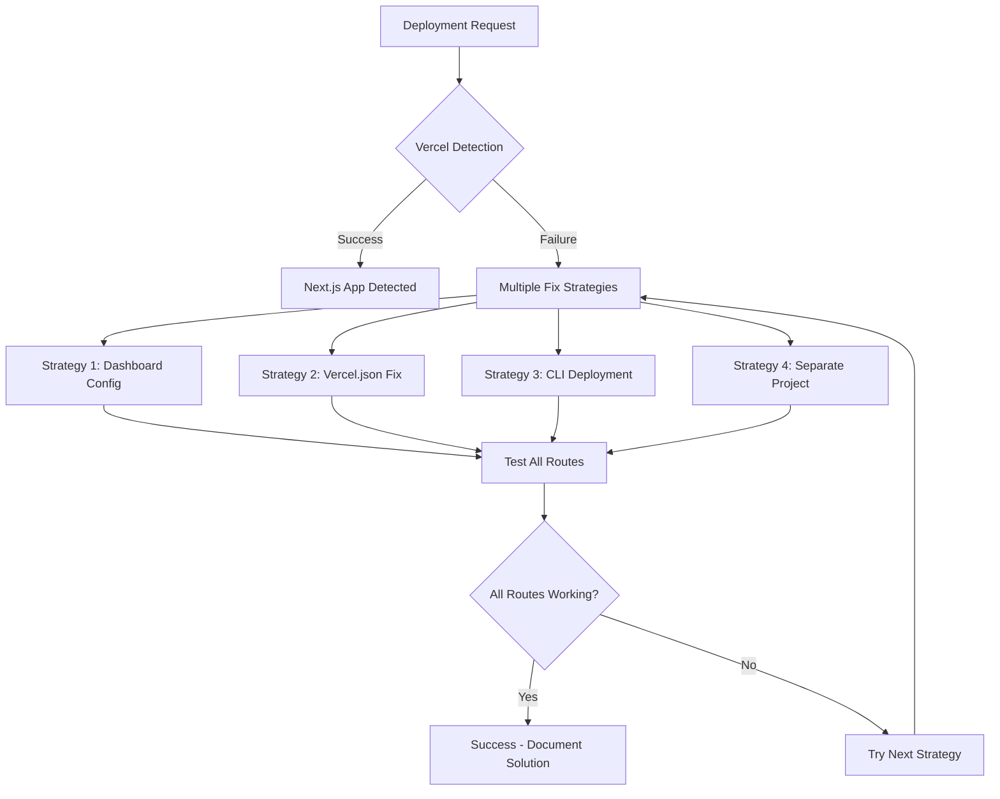

# Design Document

## Overview

This design addresses the critical issue where Vercel is not properly detecting the Next.js application in our monorepo structure, causing all dynamic routes to return 404 errors. The solution implements multiple deployment strategies with comprehensive testing and validation to ensure 100% routing functionality.

## Architecture

### Current Problem Analysis

**Root Cause**: Vercel's automatic framework detection is not recognizing the Next.js application because:
1. The application is nested in `apps/web` within a monorepo
2. The current `vercel.json` configuration may not be optimal for Next.js detection
3. Build output may not be generating proper server functions for API routes
4. Routing configuration may not be correctly mapping requests to the Next.js app

### Solution Architecture



## Components and Interfaces

### 1. Local Build Validator

**Purpose**: Verify that the Next.js application builds and runs correctly locally before deployment.

**Interface**:
```typescript
interface BuildValidator {
  validateLocalBuild(): Promise<BuildResult>
  testLocalRoutes(): Promise<RouteTestResult[]>
  checkBuildOutput(): Promise<BuildOutputAnalysis>
}

interface BuildResult {
  success: boolean
  buildTime: number
  errors: string[]
  warnings: string[]
  outputFiles: string[]
}
```

### 2. Vercel Configuration Manager

**Purpose**: Manage different Vercel configuration approaches and test their effectiveness.

**Interface**:
```typescript
interface VercelConfigManager {
  applyDashboardConfig(): Promise<ConfigResult>
  generateOptimalVercelJson(): Promise<string>
  testCliDeployment(): Promise<DeploymentResult>
  createSeparateProject(): Promise<ProjectResult>
}

interface ConfigResult {
  strategy: string
  applied: boolean
  deploymentUrl?: string
  testResults: RouteTestResult[]
}
```

### 3. Route Testing Engine

**Purpose**: Comprehensive testing of all application routes to verify functionality.

**Interface**:
```typescript
interface RouteTestEngine {
  testAllRoutes(baseUrl: string): Promise<RouteTestSuite>
  validateApiResponses(routes: string[]): Promise<ApiTestResult[]>
  checkPageContent(routes: string[]): Promise<PageTestResult[]>
}

interface RouteTestSuite {
  totalTests: number
  passed: number
  failed: number
  results: RouteTestResult[]
  successRate: number
}
```

### 4. Deployment Diagnostics

**Purpose**: Analyze deployment issues and provide detailed diagnostic information.

**Interface**:
```typescript
interface DeploymentDiagnostics {
  analyzeBuildLogs(): Promise<LogAnalysis>
  checkFrameworkDetection(): Promise<DetectionResult>
  validateConfiguration(): Promise<ConfigValidation>
  generateFixRecommendations(): Promise<FixRecommendation[]>
}

interface LogAnalysis {
  frameworkDetected: boolean
  buildErrors: string[]
  serverFunctionsGenerated: boolean
  staticAssetsGenerated: boolean
}
```

## Data Models

### Route Test Result
```typescript
interface RouteTestResult {
  route: string
  method: 'GET' | 'POST' | 'PUT' | 'DELETE'
  expectedStatus: number
  actualStatus: number
  responseTime: number
  success: boolean
  error?: string
  contentValidation?: ContentValidation
}

interface ContentValidation {
  hasExpectedContent: boolean
  contentType: string
  bodySize: number
  specificChecks: Record<string, boolean>
}
```

### Deployment Strategy
```typescript
interface DeploymentStrategy {
  name: string
  description: string
  priority: number
  steps: DeploymentStep[]
  requirements: string[]
  successCriteria: string[]
}

interface DeploymentStep {
  action: string
  description: string
  command?: string
  expectedResult: string
  rollbackAction?: string
}
```

## Correctness Properties

*A property is a characteristic or behavior that should hold true across all valid executions of a system-essentially, a formal statement about what the system should do. Properties serve as the bridge between human-readable specifications and machine-verifiable correctness guarantees.*

### Property Reflection

After reviewing all testable properties from the prework analysis, I identified several areas where properties can be consolidated:

**Consolidation Opportunities:**
- Properties 1.1, 1.2, 1.3 can be combined into a comprehensive "route functionality" property
- Properties 2.2 and 2.3 overlap significantly and can be merged
- Properties 4.1, 4.2, 4.3 are all testing validation aspects and can be combined
- Properties 3.1, 3.2, 3.3, 3.4 test different deployment strategies but can be unified under deployment success validation

**Unique Value Properties:**
- Build validation (2.1, 2.4) provides unique local verification
- Framework detection (1.5, 5.1) provides unique Vercel-specific validation
- Documentation and tracking (6.1, 6.2, 6.3) provide unique operational value

### Converting EARS to Properties

Based on the prework analysis, here are the consolidated correctness properties:

**Property 1: Route Functionality Validation**
*For any* valid application route (including `/test`, `/login`, `/api/health`), when accessed via HTTP request, the response should return the correct status code and contain the expected content type and structure.
**Validates: Requirements 1.1, 1.2, 1.3, 1.4**

**Property 2: Local Build Consistency**
*For any* Next.js application build, when executed locally with `npm run build` and `npm run start`, all routes should function identically to the deployed version with proper server functions generated.
**Validates: Requirements 2.1, 2.2, 2.3, 2.4**

**Property 3: Deployment Strategy Success**
*For any* deployment strategy (dashboard config, vercel.json, CLI, separate project), when properly applied, the resulting deployment should serve all routes correctly with Next.js framework detection confirmed.
**Validates: Requirements 3.1, 3.2, 3.3, 3.4**

**Property 4: Comprehensive Testing Validation**
*For any* deployment testing suite, when executed against a deployment, it should correctly validate route status codes, JSON response structures, and HTML content elements with accurate pass/fail reporting.
**Validates: Requirements 4.1, 4.2, 4.3, 4.5**

**Property 5: Framework Detection Analysis**
*For any* Vercel deployment, when analyzed for Next.js detection, the diagnostic system should correctly identify framework recognition status and configuration validity.
**Validates: Requirements 1.5, 5.1, 5.2**

**Property 6: Solution Tracking and Documentation**
*For any* successful fix implementation, when the solution is applied, the system should generate accurate documentation, record the successful approach, and create reusable troubleshooting guides.
**Validates: Requirements 5.4, 6.1, 6.2, 6.3**

**Property 7: Solution Ranking Accuracy**
*For any* set of multiple deployment solutions, when evaluated for effectiveness, the system should rank them correctly based on measurable reliability and implementation complexity metrics.
**Validates: Requirements 6.5**

## Error Handling

### Build Failure Recovery
- **Local Build Errors**: Provide detailed error analysis and suggested fixes
- **Dependency Issues**: Automatic detection and resolution recommendations
- **Configuration Conflicts**: Identify conflicting settings and provide corrections

### Deployment Failure Recovery
- **Framework Detection Failure**: Multiple fallback strategies with automatic retry
- **Route Configuration Errors**: Systematic testing and correction of routing rules
- **Vercel Platform Issues**: Alternative deployment methods and escalation procedures

### Testing Failure Recovery
- **Network Timeouts**: Retry mechanisms with exponential backoff
- **Unexpected Responses**: Detailed logging and error classification
- **Partial Failures**: Granular reporting and targeted fixes

## Testing Strategy

### Dual Testing Approach
The system will implement both unit testing and property-based testing for comprehensive coverage:

**Unit Tests**: 
- Specific deployment scenarios and edge cases
- Configuration validation with known good/bad examples
- Error handling with simulated failure conditions
- Integration points between deployment strategies

**Property Tests**:
- Universal route functionality across all valid endpoints (minimum 100 iterations)
- Deployment strategy effectiveness across different configurations
- Build consistency between local and deployed environments
- Testing system accuracy across various response types

### Property-Based Testing Configuration
- **Library**: fast-check (JavaScript/TypeScript property testing library)
- **Minimum Iterations**: 100 per property test
- **Test Tags**: Each property test will include a comment with format:
  - **Feature: vercel-nextjs-routing-fix, Property 1: Route Functionality Validation**
  - **Feature: vercel-nextjs-routing-fix, Property 2: Local Build Consistency**
  - etc.

### Testing Implementation Requirements
- Each correctness property must be implemented as a single property-based test
- Unit tests should focus on specific examples, edge cases, and error conditions
- Property tests should verify universal properties across randomized inputs
- All tests must reference their corresponding design document property
- Testing framework will generate comprehensive reports with success/failure details